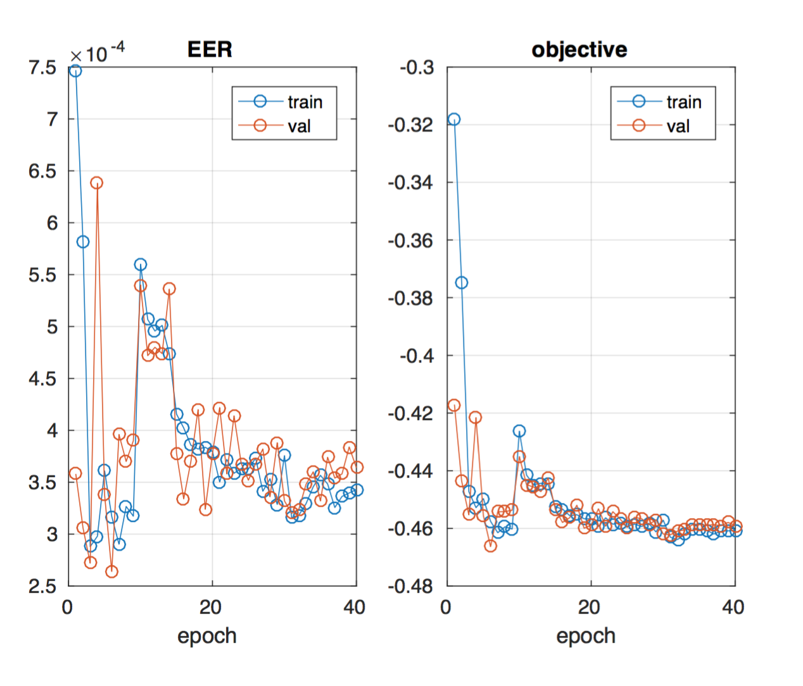

# MatConvNet-based Convolutional Neural Network layers

A (not so final) resting place for neural network layers in MatConvNet. Most rigourously tested, a few surviving on prayer, fasting and MNIST test alone. Layers include pairwise/verification utilities, matrix multiplication, L2 or regression loss, etc.

I am also working on providing small snippets of code that will demonstrate the layers on small datasets like MNIST.

### Source code organization:

All the M-files implementing the network layers are to be found under the `layers` folder.

Each `vl_*.m` file implements the logic of the forward and backward passes for a layer. Each class file wraps a particular `vl_*.m` function so that they can be used to define a DAG object in MatConvNet. 

### Example: MNIST verification using pairwise loss

We call the `cnn_mnist()` function from the examples of the MatConvNet package. This trains a LeNet-style network (without batch normalization) using the regular *softmax* loss.

Then using this as an intialization, we train the network using a pairwise verification loss. You may have to play around with the learning rate (increase or decrease by a factor of 10), depending on how many epochs the softmax training was allowed to proceed, to see the training error and objective go down steadily.

    %% Pre-training
    %   Run the MNIST baseline network with a softmax loss
    clear; 
    [net_fc, info_fc] = cnn_mnist(...
      'expDir', 'data/mnist-baseline', ... 
                'batchNormalization', false, ...
                'networkType', 'dagnn');
            
    %% Verification
    %   Using softmax loss network as initialization, train using verification
    %   loss. Default: no GPU.
    [net_v, info_v] = cnn_mnist_verif(...
      'expDir', 'data/mnist-verif-v1.2', 'batchNormalization', false, ...
                'networkType', 'dagnn', 'baseNetwork', net_fc, ...
                'train', struct('gpus', [], 'numEpochs', 40, 'learningRate', 0.0001));
                                              
                         

### Example: Adding a conv layer in DAG:
    % add a fixed layer that sums over all the channels
    %   -- pred = sum_i(w_i*x_i) + b
    sum_conv = dagnn.Conv('size',[1 1 785 1],'pad',0,'stride',1,'hasBias',false);
    net.addLayer('sum_conv', sum_conv, {'wx'}, {'pred'}, {'sum_conv_f', 'sum_conv_b'});
    net.params(net.getParamIndex('sum_conv_f')).value = ones(1, 1, 785, 1, 'single');
    net.params(net.getParamIndex('sum_conv_f')).learningRate = 0;
    net.params(net.getParamIndex('sum_conv_b')).value = single(0);
    net.params(net.getParamIndex('sum_conv_b')).learningRate = 0; 

### List of layers:

* Elementwise:
    - ElemDiv
    - ElemProd
* Losses:
    - LossRegul: regulariser on the features/activations. L1 or L2. 
    - L2Loss: Regression loss between targets and outputs.
    - PairwiseLoss: for verification or siamese networks
        + minimise distance between same pairs
        + maximise distance between different pairs
        + tested on MNIST
* Normalizers:
    - L2Norm: L2-normalize features to 1 in 2-norm. Taken from [B-CNN](https://bitbucket.org/tsungyu/bcnn.git) codebase.
* Funky/Misc:
    - MixBasis: Form a linear combination of two branches of a network:
        + branch 1 gives a vector
        + branch 2 gives a matrix
        + output of MixBasis is the linear combination of the cols of the matrix using the elements of the vector as weights
    - BatchSplit: split the batch into two -- even and odd numbered samples. This can be pretty handy when training a siamese network for face verification. 

